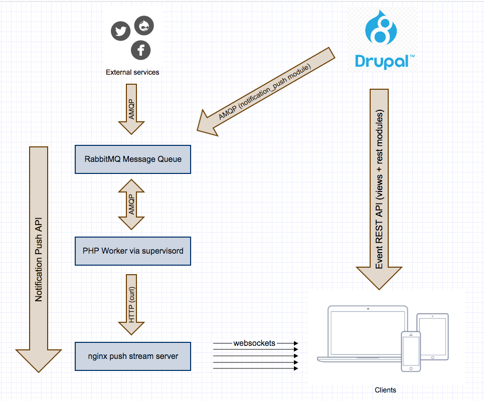

# LISSA Kickstart Distrubution

LISSA is an open source technology stack for real time messaging in second
screen applications. It allows media providers to publish live and on-demand
video streams and push related notifications to clients.

The LISSA Kickstart profile is a reusable Drupal 8 distribution for managing
and publishing events and notifications. It comes pre-configured with the
following functionality:

- Real-time push message API through the LISSA backend stack for publishing
  live notifications.
- REST API for publishing events.
- REST API for publishing on-demand notifications.
- A proof-of-concept for soccer matches with contextual soccer statistics.
- Twitter integration for pushing notifications to a Twitter account.

## Installation

### Using Vagrant

The recommended way to install the LISSA distribution is by using the LISSA
[infrastructure](https://github.com/oneagency/lissa_infrastructure) and
[deploy](https://github.com/oneagency/lissa_deploy) repositories on GitHub.
The infrastructure repo will provision a Vagrant box containing all the
required services and the deploy repo will install and configure a Drupal 8
instance with the LISSA Kickstart distribution.

#### Requirements

- Bundler
- OSX: Xcode command line tools: xcode-select --install
- Virtualbox 4.3.10+
- Vagrant 1.6.3
- vagrant-omnibus plugin
- vagrant-hostsupdater plugin
- Git

#### Vagrant setup

```
git clone https://github.com/oneagency/lissa_infrastructure
cd lissa_infrastructure
vagrant up --provision`
```

#### Drupal installation

```
git clone https://github.com/oneagency/lissa_deploy
cd lissa_deploy
bundle install
bundle exec cap local deploy
```

### Using Phing

You can set up the Drupal distribution with Phing following these steps:

- cd to the root of this repository
- Execute the following command: phing -Ddocroot=/path/to/docroot
- Replace /path/to/docroot/parent with the path of your virtual host.

The following steps will be executed:

- Create a docroot directory under /path/to/docroot/parent
- Execute drush make on the build.make file
  - Drush make will set up drupal 8 core
  - Drush make will add the lissa_kickstart profile to the profiles directory
  - Drush make will execute the lissa_kickstart.make file
- Execute drush site-install with the parameters provided in
  build.defaults.properties

### Manual Installation

If you decide to install LISSA Kickstart manually please keep the following
things in mind:

- Use the Drupal core version specified in the build.make file. Other versions
  of Drupal 8 may not be compatible.
- Install the contrib modules specified in the lissa_kickstart.make file.
- Install the services (see the [infrastructure repo](https://github.com/oneagency/lissa_infrastructure))
  for versions and configuration):
  - A RabbitMQ server
  - An Nginx push stream server
  - A service running the [worker PHP script](https://github.com/oneagency/lissa_worker)


### Server Installation

You can provision your own server for a LISSA Kickstart installation by using
the [infrastructure](https://github.com/oneagency/lissa_infrastructure) repo
on GitHub. This contains a set of Chef cookbooks with all the necessary services
for running the full LISSA technology stack.

After provisioning a server you can clone the
[deploy](https://github.com/oneagency/lissa_deploy) repository for deploying the
distribution using capistrano.

#### Distributed Servers

The [infrastructure](https://github.com/oneagency/lissa_infrastructure) repo
has support for provisioning the backend across multiple servers. See the
documentation included with the repository for more information.

## Demo

You can test the application using the demo web client located at <http://admin.lissa.dev/profiles/lissa_kickstart/test/client/demo.html>.

The test web application will:

- Load all events from the Drupal 8 REST event API.
- Load all existing notifications from the Drupal 8 REST notification API.
- Set up websocket connections to all events.

Notifications added to events will show up automatically in the test web application.

## Architecture



The LISSA stack is divided in the following components:
 
### Drupal 8

The administration backend where operators manage events and notifications.
Using the views and rest modules it also provides a REST API for fetching all
published events and past notifications.

Runs on port 80 in the default infrastructure single server setup:

<http://admin.lissa.dev>

### RabbitMQ MessageQueue

A message queue for storing and forwarding the real time notifications to
clients. External services like Facebook, Twitter or other Drupal sites can
plugin to the queue to send additional data in real time to clients.

Runs on port 15672 in the default infrastructure single server setup:

<http://admin.lissa.dev:15672>

### PHP Worker

Parses the notifications from the message queue and forwards them to the nginx
push stream server. This can be used for additional processing prior to sending
the data to clients. It also increases scalability by providing multiple
workers.

There's an implementation that is set up either using the infrastructure repo or
by running the worker.php script from the [worker repo](https://github.com/oneagency/lissa_worker)
using a process manager like supervisord.

### Nginx push stream server

Allows websocket connections for pushing the notification to clients.

Runs on port 8080 with the following endpoints:

- /publish/uuid: publish notifications to all clients
- /ws/uuid: websocket endpoint for clients.

uuid can be replaced by the UUID of the event node a clients wants to receive
notifications from.
